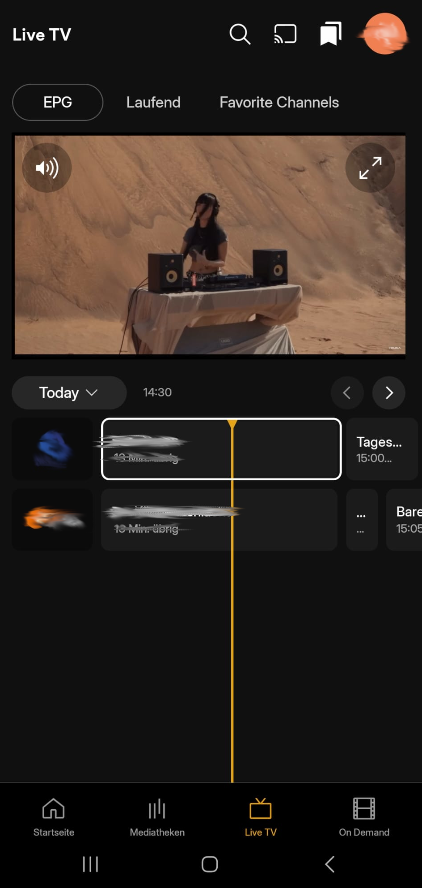

# PuppeteerCast

  

 

 

PuppeteerCast is a system that converts web browser content into live video streams accessible via HTTP endpoints. The system uses headless browser automation to navigate and interact with web pages, captures the visual and audio output, encodes it into streaming formats, and serves it through multiple API interfaces compatible with various client applications.

The core transformation process involves running a web browser in a virtual display environment, capturing both screen content and audio output, and encoding this media into transport streams that can be consumed by streaming clients, TV applications, and media players.

## Implementation

- [ ] Config Setup
- [x] Audio and video stream
- [x] Channels
  - [ ] ChannelManager
    - [ ] Channel List/Register
- [x] Browser automation
  - [ ] Provider-Manager
    - [ ] Any Provider
- [x] HDHomeRun Protocol
  - [x] SSDP Broadcast 
  - [x] Discover
  - [x] LineUp and LinupStatus
  - [ ] EPG
  - [ ] User-Auth?
- [x] API Server (HTTPS)
  - [x] Reverse-Proxy Support
  - [ ] User-Auth?
- [ ] Plugin-System
- [ ] Frontend?

# Sample see stream on other client
Movie from the site (Pupetteer) -> HDHomeRun -> Somthing Media Server -> Somthing Client on the mobile phone

### Sources
- <a href="https://www.flaticon.com/free-icons/cast" title="cast icons">Cast icons created by Google - Flaticon</a>
